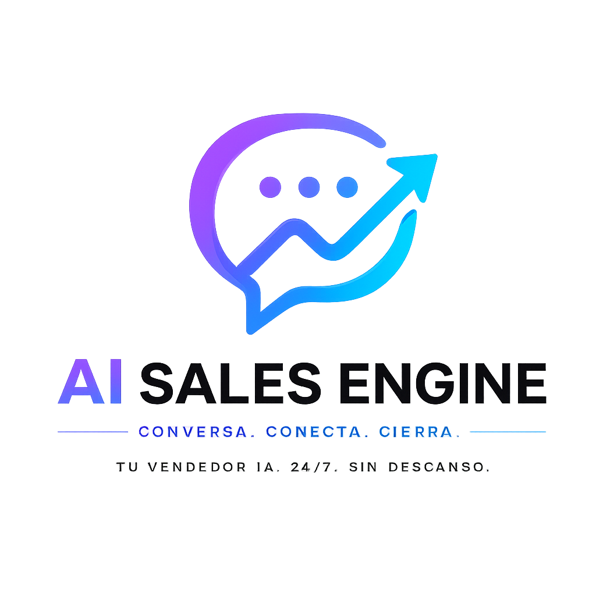

<p align="center">
  
</p>

<h1 align="center">AI Sales Engine</h1>

<p align="center">
  Motor conversacional AI-first para ventas SaaS multi-tenant
</p>

# AI Sales Engine — Vendedor Conversacional por WhatsApp

Convierte conversaciones en ventas reales sin depender de disponibilidad humana.

Responde como un humano, entiende el contexto y guía cada cliente hacia una acción concreta: avanzar, agendar o comprar.

No es una automatización genérica.

Es un sistema de ventas.

---

## Ejecución

Levantar el sistema:

```bash
cd project
uvicorn app.main:app --reload
```

Simular interacción:

```text
POST /api/v1/simulate
```

Header:

```text
X-Tenant-Slug: asesor_ai_prod
```

Payload:

```json
{"user_message": "mensaje del cliente", "user_id": "demo_1"}
```

---

## Escenarios de prueba

El sistema no está limitado a un tipo de negocio.

Su comportamiento se adapta según la configuración del tenant (YAML).

Ejemplos:

**Servicios (ej: marketing / automatización):**

- "tengo muchos clientes escribiéndome y no alcanzo a responder"
- "eso cuánto cuesta realmente"
- "cómo empiezo con ustedes"

**Salud / estética:**

- "quiero más pacientes pero no me escriben"
- "eso sí funciona o es lo mismo de siempre"
- "cómo agendo una prueba"

**Ecommerce / ventas:**

- "me llegan mensajes pero no compran"
- "está muy caro comparado con otros"
- "qué tengo que hacer para empezar"

---

## Resultado esperado

- entiende el contexto del negocio
- identifica el momento del cliente
- responde con dirección comercial
- guía la conversación hacia acción

---

## Configuración por tenant

El comportamiento no cambia por código.

Se controla completamente mediante configuración por tenant:

- business.yaml -> contexto del negocio
- config.yaml -> parámetros generales del sistema
- inventory.yaml -> oferta / servicios disponibles
- pricing.yaml -> estructura de precios
- sales.yaml -> lógica comercial y enfoque de ventas

Esto permite adaptar el sistema a cualquier negocio sin modificar lógica interna.

El mismo motor puede operar en:

- servicios
- salud
- ecommerce
- educación
- cualquier modelo comercial

## 📚 Documentación

- [Quickstart](docs/quickstart.md)
- [Arquitectura](docs/architecture.md)
- [SaaS](docs/saas.md)
- [Operación](docs/operations.md)
- [Producto](docs/product.md)

---

AI Sales Engine es un sistema SaaS de atención comercial conversacional para WhatsApp y canales relacionados. Su propósito no es responder mensajes aislados, sino operar conversaciones de venta con contexto, continuidad y criterio comercial para mover al cliente hacia una acción concreta.

El sistema está diseñado para equipos que necesitan:

- responder leads entrantes sin perder velocidad de atención
- mantener continuidad entre turnos sin depender de un operador humano en cada mensaje
- operar varios clientes o negocios sobre la misma plataforma
- controlar grounding comercial por tenant, pricing, capacidades y contexto real del negocio
- convertir conversaciones en avance comercial, no solo en respuestas correctas

La aplicación activa vive en la carpeta `project/`. La carpeta `tests/` contiene la suite canónica que protege el comportamiento comercial y técnico del sistema.

## Qué Resuelve

En la práctica, el problema no es solo “responder por WhatsApp”. El problema es que, cuando una empresa no responde rápido, responde sin contexto o responde sin dirección comercial, pierde oportunidades ya captadas.

AI Sales Engine ataca ese problema en cuatro niveles:

- atención inmediata: reduce el tiempo entre mensaje entrante y respuesta útil
- continuidad comercial: recuerda el contexto reciente y evita reiniciar la conversación en cada turno
- grounding por negocio: responde usando el contexto real del tenant, no texto genérico inventado
- empuje a siguiente paso: orienta la conversación hacia prueba, activación, pago o continuación del proceso comercial

No es una plantilla rígida de respuestas. Es un runtime AI-first con contexto controlado, memoria conversacional y restricciones de negocio por tenant.

## Arquitectura Del Sistema

El flujo real hoy parte de FastAPI y entra por webhook de WhatsApp o por el endpoint de simulación. La ruta productiva activa usa Meta WhatsApp como conector de salida.

### Diagrama De Arquitectura

```text
Entrada A: WhatsApp Cloud API (webhook Meta)
	-> project/app/main.py
	-> project/app/api/routes.py
	-> project/app/api/controllers/whatsapp_webhook.py
	-> project/app/services/tenant_channel_resolver.py
	-> project/app/connectors/router.py
	-> project/app/connectors/whatsapp/meta/parser.py
	-> project/app/application/runtime/tenant_runtime_loader.py
	-> project/app/application/runtime/runtime_yaml_builder.py
	-> project/app/infrastructure/config/config_service.py
	-> project/app/services/ai_service.py
	-> project/app/application/ai_pipeline.py
	-> project/app/application/pipeline/saas_guard.py
	-> project/app/application/pipeline/conversation_flow.py
	-> project/app/application/pipeline/sales_flow.py
	-> project/app/application/pipeline/ai_execution.py
	-> project/app/application/pipeline/response_router.py
	-> project/app/services/ai/ai_orchestrator.py
	-> project/app/infrastructure/ai/prompting/builder/prompt_builder.py
	-> project/app/domain/ai/prompt_context.py
	-> project/app/services/ai_runtime/runtime_llm/client.py
	-> project/app/services/ai/structured_output.py
	-> project/app/application/pipeline/response_postprocessor.py
	-> project/app/application/response_guard.py
	-> project/app/connectors/whatsapp/transport_runtime.py
	-> project/app/connectors/whatsapp/transport/sender.py
	-> project/app/connectors/whatsapp/meta/sender.py
	-> respuesta enviada al cliente

Entrada B: API de simulación
	-> project/app/main.py
	-> project/app/api/routes.py
	-> project/app/api/controllers/simulation.py
	-> project/app/services/ai_service.py
	-> mismo pipeline AI-first
	-> respuesta JSON para validación local, demo y QA
```

### Lectura Del Flujo

1. FastAPI expone el sistema desde `project/app/main.py`.
2. `project/app/api/routes.py` monta controladores HTTP.
3. `project/app/api/controllers/whatsapp_webhook.py` recibe el evento de Meta y resuelve el tenant usando `phone_number_id`.
4. `project/app/connectors/router.py` normaliza el payload entrante a un formato interno unificado.
5. `project/app/application/runtime/tenant_runtime_loader.py` arma el `runtime_yaml` efectivo del tenant.
6. `project/app/services/ai_service.py` delega la ejecución a `project/app/application/ai_pipeline.py`.
7. El pipeline valida acceso SaaS, continuidad conversacional, contexto comercial y ejecución AI-first.
8. `project/app/services/ai/ai_orchestrator.py` construye el prompt y llama al cliente LLM real en `project/app/services/ai_runtime/runtime_llm/client.py`.
9. La salida estructurada se parsea en `project/app/services/ai/structured_output.py`.
10. La respuesta pasa por postproceso y guardas mínimas.
11. `project/app/connectors/whatsapp/meta/sender.py` la envía al canal real.

### Nota Importante Sobre El Runtime

La arquitectura activa no está separada en módulos llamados `decision_engine` o `narrative_builder`. Esas responsabilidades viven hoy distribuidas entre:

- `project/app/application/pipeline/sales_flow.py`
- `project/app/application/pipeline/response_router.py`
- `project/app/services/ai/ai_orchestrator.py`
- `project/app/services/ai/structured_output.py`
- `project/app/infrastructure/ai/prompting/builder/prompt_builder.py`

Eso es importante para documentar correctamente el sistema actual y no una arquitectura deseada o histórica.

## Comportamiento De Ventas

El diferencial del sistema no es “responder bonito”. El diferencial es el comportamiento comercial que busca mover la conversación desde interés o dolor hacia acción.

### Secuencia Comercial Base

```text
dolor -> impacto -> dinero -> solución -> acción
```

### Cómo Detecta Dolor
